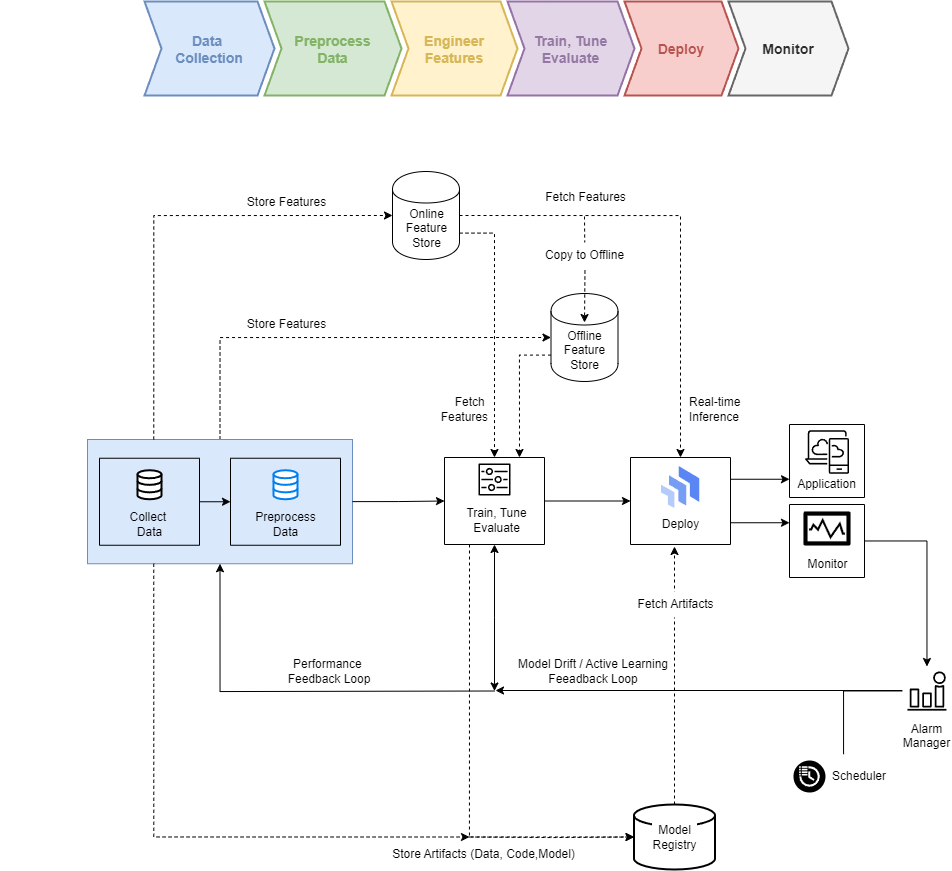

# MLOps for Fraud Detection

## Overview
This project implements a complete MLOps lifecycle for a fraud detection model, utilizing various technologies such as Kafka, TensorFlow Data Validation (TFDV), and Google Cloud Platform (GCP). The goal of this project is to create a fully automated and production-ready environment where new data is ingested, validated, used for retraining, and monitored seamlessly.

The project is designed with scalability in mind, using Google Kubernetes Engine (GKE) and Kubernetes to deploy each pipeline. The entire ML lifecycle is managed with Airflow to enable active learning and periodic retraining. The model is trained and re-trained with Differentially Private Stochastic Gradient Descent (DP-SGD) to ensure data privacy.

Key features include:
- **Data Ingestion** with Kafka
- **Data Validation** with TensorFlow Data Validation (TFDV)
- **Model Training, Deployment, and Monitoring** using TensorFlow, GCP, Docker, and Prometheus
- **Active Learning and Retraining** using Airflow DAGs
- **Differential Privacy** using DP-SGD to ensure data privacy



## Technologies Used
- **Google Cloud Platform (GCP)**: GKE, Google Cloud Storage, Vertex AI (optional for future scaling)
- **Docker**: For containerizing all services and pipelines
- **Kubernetes**: For deploying and orchestrating all containers on GKE
- **Kafka**: For streaming data ingestion
- **TensorFlow & Keras**: For building and training the fraud detection model
- **TFDV**: For validating data and detecting drift
- **Airflow**: For managing the ML pipeline DAGs, ensuring automated retraining and deployment
- **Prometheus & Grafana**: For monitoring model performance and metrics
- **TensorFlow Privacy**: For implementing DP-SGD to ensure data privacy during training


## Workflow
### 1. Data Ingestion
The data ingestion process utilizes Kafka to stream transactions into the system. A Kafka consumer ingests this data and stores it in a CSV file (`data/new_transactions.csv`).

**Technologies**: Kafka, Python

**Deployment**: Deployed as a Docker container and orchestrated using Kubernetes. YAML configuration for deployment is located at `infra/kubernetes/data_ingestion.yaml`.

### 2. Data Preparation and Validation
Data preparation is done using SMOTE to balance the classes and standard preprocessing steps. We use TFDV to validate new incoming data to ensure it matches the schema and identify potential data drift.

**Technologies**: Python, TFDV, SMOTE

**Deployment**: Data preparation is also containerized and orchestrated using Kubernetes. Airflow is used to manage data quality over time.

### 3. Training Pipeline
The training pipeline is triggered for the initial training of the model. It takes the prepared data and trains a fraud detection model using TensorFlow, implementing Differential Privacy with DP-SGD to protect sensitive data.

**Technologies**: TensorFlow, TensorFlow Privacy, Python

**Deployment**: Deployed on Kubernetes, leveraging GCP resources for scalability.

### 4. Model Deployment
Once the model is trained, it is deployed using Flask in a Docker container. Kubernetes and GCP are used to manage and scale the deployment.

**Endpoint**: `/predict` to predict whether a transaction is fraudulent.

**Deployment**: Deployment configurations are defined in `kubernetes/model_deployment.yaml`.

### 5. Monitoring Pipeline
Monitoring is handled using Prometheus and Grafana to track model performance metrics such as latency, accuracy, and data drift metrics detected by Evidently.

**Deployment**: Configured with Docker and Kubernetes to scale monitoring across GKE nodes.

### 6. Active Learning and Retraining
Airflow DAG (`active_learning.py`) manages the active learning process. It ingests new data, validates it, and triggers model retraining if necessary. This ensures the model is continuously improved with the latest data. Retraining uses DP-SGD for differential privacy.

**Technologies**: Airflow, TFDV, TensorFlow Privacy, TensorFlow

**Deployment**: Managed through Airflow with Kubernetes pods for each stage.

## Instructions to Run the Project
### 1. Setup Environment
- Clone the repository:
  ```bash
  git clone https://github.com/ign24/fraud_detection_mlops/
  ```
- Install dependencies:
  ```bash
  pip install -r requirements.txt
  ```
- Set up Kafka locally or connect to a Kafka broker.
- Install Docker and Kubernetes tools (`kubectl`).
- Set up GCP credentials:
  ```bash
  export GOOGLE_APPLICATION_CREDENTIALS="[PATH_TO_CREDENTIALS_JSON]"
  ```

### 2. Deploy Pipelines with Kubernetes
- **Data Ingestion**: Deploy the data ingestion pipeline using the provided YAML file.
  ```bash
  kubectl apply -f kubernetes/data_ingestion.yaml
  ```
- **Training, Deployment, Monitoring**: Similarly deploy the other components using the corresponding YAML files.

### 3. Deploying Active Learning DAG
- Ensure Airflow is set up and running.
- Place `active_learning_dag.py` in the Airflow DAGs folder to automate active learning.

### 4. Monitoring
- Prometheus and Grafana are configured to run as containers and provide metrics for the deployed model.

## Model Registry and Artifacts
- **MLflow** is used to manage and track model versions, keeping track of metrics, artifacts, and model versions.
- The models are saved as `.keras` files and stored in a GCP bucket for scalability.

## Scaling in GCP
- The project is designed to be deployed both locally and in GCP. GCP resources such as Google Kubernetes Engine (GKE) are leveraged for scaling.
- Future iterations could incorporate **Vertex AI** for simplifying model retraining and deployment processes.

## Security Considerations
- **Differential Privacy**: Implemented DP-SGD to protect sensitive information during training.
- **Sensitive Data**: Use Kubernetes secrets for sensitive information like API keys and database credentials.
- **Role-Based Access Control (RBAC)**: Implement RBAC in GKE to limit access.
- **Network Security**: Use VPC for managing internal traffic between components securely.

## Contributing
- Fork the repository and create a feature branch.
- Make changes and submit a pull request for review.
- All contributions are welcome to enhance functionality, security, or scalability.

## License
This project is licensed under the MIT License - see the LICENSE file for details.

## Contact
For more information or questions, contact [Ignacio](ignacio_zu@outlook.com) or connect on [LinkedIn](https://www.linkedin.com/in/ignacio-z%C3%BA%C3%B1iga/).

---
### Notes for Reviewers
This project is a full end-to-end implementation of MLOps best practices for fraud detection, showcasing skills in data engineering, ML model building, deployment, monitoring, and retraining with GCP integration. It represents practical industry knowledge in building resilient, scalable, and maintainable ML workflows.
